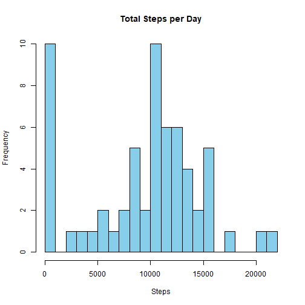
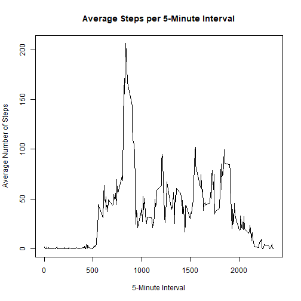
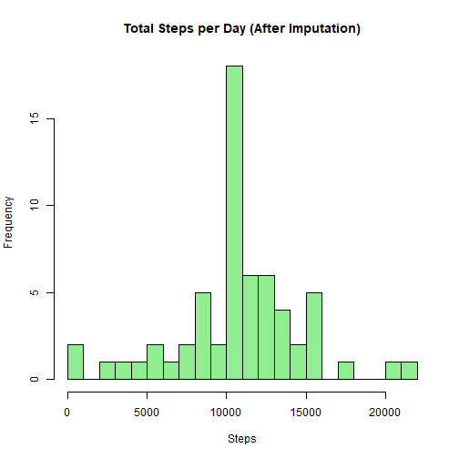
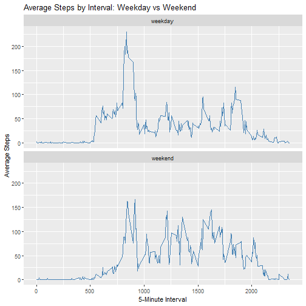

# Loading and preprocessing the data


``` r
data <- read.csv("activity.csv")
data$date <- as.Date(data$date)
```

## What is mean total number of steps taken per day?


``` r
library(dplyr)

# Hitung total langkah per hari
total_steps <- data %>%
  group_by(date) %>%
  summarise(total = sum(steps, na.rm = TRUE))

# Buat histogram
hist(total_steps$total,
     main = "Total Steps per Day",
     xlab = "Steps",
     col = "skyblue",
     breaks = 20)
```



``` r
# Hitung mean dan median
mean(total_steps$total)
```

```
## [1] 9354.23
```

``` r
median(total_steps$total)
```

```
## [1] 10395
```

## What is the average daily activity pattern?


``` r
# Hitung rata-rata langkah per interval
interval_avg <- data %>%
  group_by(interval) %>%
  summarise(avg_steps = mean(steps, na.rm = TRUE))

# Buat time series plot
plot(interval_avg$interval, interval_avg$avg_steps,
     type = "l",
     main = "Average Steps per 5-Minute Interval",
     xlab = "5-Minute Interval",
     ylab = "Average Number of Steps")
```



``` r
# Interval dengan rata-rata langkah tertinggi
interval_avg[which.max(interval_avg$avg_steps), ]
```

```
## # A tibble: 1 × 2
##   interval avg_steps
##      <int>     <dbl>
## 1      835      206.
```

## Imputing missing values


``` r
# Hitung jumlah NA di kolom steps
missing_values <- sum(is.na(data$steps))
missing_values
```

```
## [1] 2304
```

``` r
# Strategi: Gantikan NA dengan rata-rata langkah di interval yang sama
# Buat salinan dataset
data_filled <- data

# Ganti NA dengan rata-rata langkah per interval
data_filled$steps <- ifelse(is.na(data_filled$steps),
                            interval_avg$avg_steps[match(data_filled$interval, interval_avg$interval)],
                            data_filled$steps)

# Hitung ulang total langkah per hari setelah imputasi
total_steps_filled <- data_filled %>%
  group_by(date) %>%
  summarise(total = sum(steps))

# Histogram baru
hist(total_steps_filled$total,
     main = "Total Steps per Day (After Imputation)",
     xlab = "Steps",
     col = "lightgreen",
     breaks = 20)
```



``` r
# Mean dan Median baru
mean(total_steps_filled$total)
```

```
## [1] 10766.19
```

``` r
median(total_steps_filled$total)
```

```
## [1] 10766.19
```

## Are there differences in activity patterns between weekdays and weekends?


``` r
# Tambahkan kolom "day_type"
data_filled$day_type <- ifelse(weekdays(data_filled$date) %in% c("Saturday", "Sunday"),
                               "weekend", "weekday")
data_filled$day_type <- as.factor(data_filled$day_type)

# Hitung rata-rata langkah per interval dan day_type
interval_daytype_avg <- data_filled %>%
  group_by(interval, day_type) %>%
  summarise(avg_steps = mean(steps))
```

```
## `summarise()` has grouped output by 'interval'. You can override using
## the `.groups` argument.
```

``` r
# Load library ggplot2
library(ggplot2)

# Buat panel plot
ggplot(interval_daytype_avg, aes(x = interval, y = avg_steps)) +
  geom_line(color = "steelblue") +
  facet_wrap(~day_type, ncol = 1) +
  labs(title = "Average Steps by Interval: Weekday vs Weekend",
       x = "5-Minute Interval", y = "Average Steps")
```


